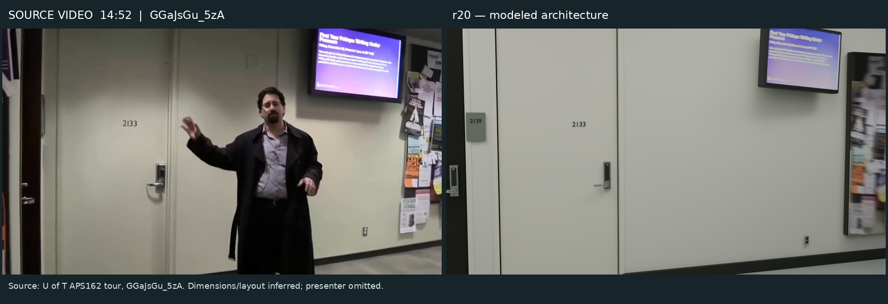
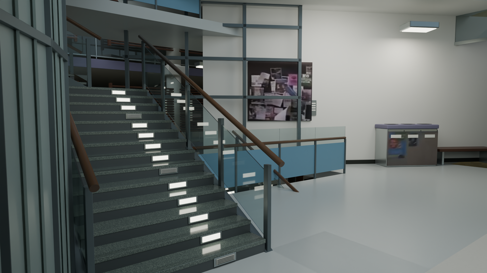

# Bahen Centre — reconstruction from the video tour

[**Explore the 3D model**](https://alecjacobson.github.io/astra-dgp/viewer/) · [**Video/render comparisons**](https://alecjacobson.github.io/astra-dgp/gallery.html) · [Offline viewer](bahen-centre-viewer.html) · [GLB](bahen-centre.glb) · [Blender scene](bahen-centre.blend)



The model is built from the complete **43:01.6, 720p source MP4**, including close views around the requested timestamp. Direct yt-dlp requests were blocked; the original Googlevideo track was recovered from an Internet Archive capture. **135 timestamped frames** were decoded across the full tour, including the requested **14:52 / frame 26760**. [Acquisition record](review/VIDEO_ACQUISITION.md) · [SHA256 and frame catalog](review/frame-catalog.json).

The video corrected major first-draft assumptions. Room 2133 is a cream door along the second-floor gallery. The illuminated central stairs are straight flights beside curved glazing; the old continuous spiral was removed. The finished pass adds satin metal hardware, actual video-derived monitor and notice textures, polished terrazzo steps, round timber rails, blue lower guards with clear upper panes, and a connected stair lobby. The curved channel-glass rooms sit inside a separately modeled outer envelope. The theatre has warm wall finishes, rounded seats, sliding chalkboards and a luminous roof recess.

**This is a source-guided architectural approximation.** Selected local camera anchors align closely, especially at 14:30 and 14:52. Dimensions, global registration of rooms, hidden spaces, repeated upper floors, exterior massing and the overall footprint remain inferred. It is not a measured survey or photogrammetric recovery. The comparison gallery makes residual differences visible; the presenter is intentionally omitted from the architecture.



## Explore and download

- **Online:** orbit/pan/zoom, jump to timestamped views, open the shell, hide landscape and save screenshots. WASD moves horizontally; Q/E vertically, without collision detection.
- **Offline:** download `bahen-centre-viewer.html` using GitHub's download button. Open it directly; Three.js and the complete model are embedded.
- **Blender:** editable named objects, procedural materials, lights and review cameras. Blender 4.5; metres; Z up.
- **Editable GLB:** embedded textures, standard glTF 2.0, named construction groups; Y up.
- **Interactive model:** [lighting-baked GLB](viewer/bahen-lit.glb), with Cycles direct/indirect illumination embedded in UV atlases. Glass, metal and the plain white theatre seats retain live materials. Cutaway mode uses neutral shading on the site/foundation so enclosed-floor shadows do not hide the structure. Architectural surfaces retain their baked illumination; the editable Blender scene remains the reference for relighting. Phones decode smaller lighting atlases to reduce memory use; the downloadable model retains full-resolution maps.

## Render, compare, revise

The first six revisions were guided by preview photographs. The video-driven R07–R14 series replaced that limited evidence with actual decoded frames. The R15–R20 finish pass rebuilt the lobby depth, softened illumination, corrected materials and close details, closed the exterior envelope, and carried native lighting into the viewer. An independent judging agent challenged both the main and offset views. Corrections were tested by rendering the same 16:9 view repeatedly and comparing source anchors, occlusion, stair direction, floor connectivity, materials and background geometry.

[Comparison gallery](https://alecjacobson.github.io/astra-dgp/gallery.html) · [Video route and certainty](review/video-route.md) · [Final polish review](review/judge-final-polish.md) · [Selected camera-anchor check](review/camera-anchor-check.json) · [Iteration record](review/ITERATIONS.md) · [Progress screenshots](progress/history.md).

Screenshots are committed about every ten minutes during active work. The full source MP4 and bulk decoded frames stay local; selected source frames appear in clearly attributed side-by-side comparisons.

## Reproduce

Requires Blender 4.5, Python with OpenCV/Pillow/NumPy/requests/yt-dlp, and Node.js to rebuild the viewer. The source geometry can be rebuilt without downloading reference media.

```sh
python scripts/acquire_video.py
python scripts/extract_video_frames.py references/tour.mp4
BAHEN_REV=rebuilt blender -b --python scripts/build_model.py
BAHEN_REV=rebuilt blender -b bahen-centre.blend --python scripts/render_views.py -- video_1430 video_1452 video_0030 video_0330 video_0630 video_0730 exterior
python scripts/make_textures.py
blender -b bahen-centre.blend --python scripts/export_model.py
blender -t 8 -b bahen-centre.blend --python scripts/bake_viewer.py -- --scope full --output viewer/bahen-lit.glb --size 1024 --hero-size 4096 --samples 32 --texture-format JPEG --exposure=-0.5 --exposure-map '{"11":-1.1,"13":-0.75}'
cd viewer
npm install
npm run build
cd ..
python scripts/assemble_viewer.py
```

Serve with `python -m http.server 8766` and open `http://localhost:8766/viewer/`. `scripts/test_viewer.py` checks model loading, view presets, controls, screenshots, keyboard movement, mobile layout and offline loading. `scripts/audit_glb.py` checks embedded assets and geometry. `scripts/check_camera_anchors.py` projects a small set of manually identified source points; it does not certify full-image similarity. Set `BAHEN_WIDTH`, `BAHEN_SAMPLES` and `BAHEN_CHROME` as needed.

## Sources and credits

- [APS162: Form versus Function — A Tour of the Bahen Centre](https://www.youtube.com/watch?v=GGaJsGu_5zA&t=892s), University of Toronto Faculty of Applied Science & Engineering. Actual timestamps 00:30,03:30,06:30,07:30,14:30 and 14:52 drive the published comparisons. [Full source record](review/sources.json).
- [University Planning, Design & Construction](https://updc.utoronto.ca/project/bahen-centre/), supplementary architectural photographs; credits include Roberta Baker and Makeda Marc-Ali.
- [University of Waterloo architecture teaching gallery](https://www.tboake.com/sustain_casestudies/bahen_gallery.html), photographs by Nathaniel Lloyd, used to distinguish the translucent interior curved rooms from the outer envelope.
- [University of Toronto Campus Events](https://campusevents.utoronto.ca/event-spaces/centrally-shared-spaces/bahen-centre/), supplementary atrium photographs and event-space plan.

The workflow and geometry helpers draw on the adjacent `astra-house` project. Stone, timber and masonry materials are authored approximations. The monitor, noticeboards and recycling labels use perspective-rectified crops from the supplied video; [texture provenance](review/texture-provenance.json) records every source frame and crop. Source resolution limits their detail at close zoom. The architecture is editable 3D geometry; the cropped images are surface details on modeled objects. Three.js uses the [MIT license](licenses/THREE-LICENSE.txt).
