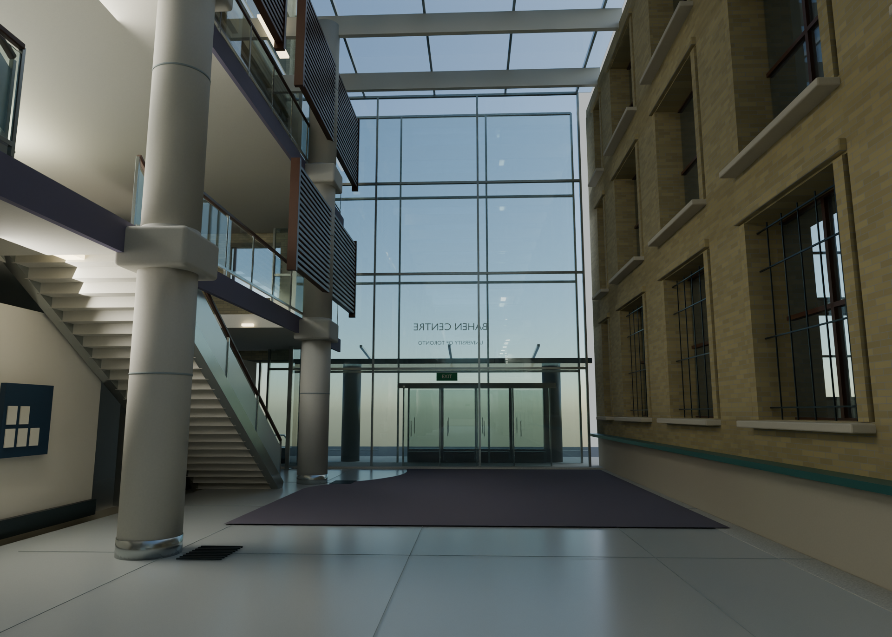
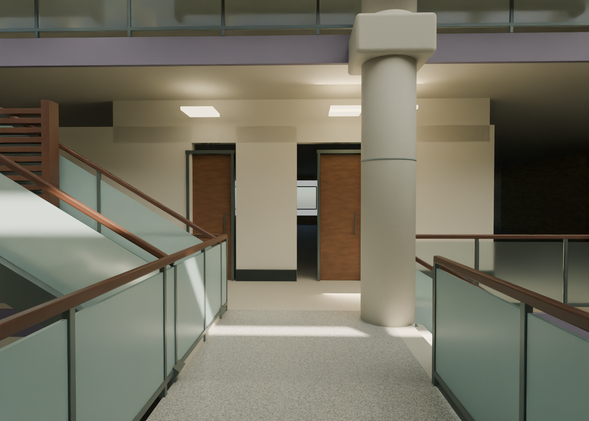

# Bahen Centre — architectural reconstruction

[**Open the interactive model**](https://alecjacobson.github.io/astra-dgp/viewer/) · [Download the offline viewer](bahen-centre-viewer.html) · [GLB](bahen-centre.glb) · [Editable Blender scene](bahen-centre.blend)



A photo-guided model of the University of Toronto's Bahen Centre, with its public atrium, preserved brick facade, concrete columns, timber screens, glass guards, stairs and bridges, central glazed lantern, retained house, and schematic exterior/context. The model contains approximately 4,500 individually named components, organized into ten layers.

**Evidence limitation:** YouTube blocked full extraction of the [requested tour at 14:52](https://www.youtube.com/watch?v=GGaJsGu_5zA&t=892s). Three public preview frames and its stair-landing thumbnail were accessible and used. Their timestamps are unknown. Official University photographs supplement those frames. Overall dimensions, footprint, hidden spaces, feature placement and exterior massing are inferred; this is not a measured survey or photogrammetric reconstruction.

## Explore

- **Online viewer:** orbit, pan and zoom; jump to the atrium, landing, lantern or street; open the building shell; hide landscaping; save a screenshot. WASD moves horizontally and Q/E vertically, without collision detection.
- **Offline viewer:** download `bahen-centre-viewer.html` using GitHub's download/raw button and open it directly. The model and Three.js are embedded; no server or network is needed.
- **Native scene:** `bahen-centre.blend`, Blender 4.5.3, preserves individual objects, procedural materials, lights and named review cameras. Coordinates use metres with Z up.
- **Portable model:** `bahen-centre.glb`, textured glTF 2.0 with standard Y up and named construction groups. The browser batches geometry and simplifies glass/lighting for responsiveness; its appearance differs from Cycles.

## Render-and-review loop

Six numbered build revisions, a final packaging build, and six rendered passes refined the geometry. An independent judging agent reviewed the initial, fourth and final views against the source photographs. Corrections include atrium height, window reveals, glazing rhythm, stair orientation/access, landing joints, heritage roof alignment, material mapping and lighting artifacts.

[Render gallery](https://alecjacobson.github.io/astra-dgp/gallery.html) · [Iteration record](review/ITERATIONS.md) · [Independent reviews](review/) · [Source catalog](review/sources.json) · [Progress screenshots](progress/history.md)

Progress screenshots were committed approximately every ten minutes during active development; the final checkpoint is added on completion. Third-party reference images are retained locally and are not republished in this repository.



## Rebuild

Requires Blender 4.5, Python with Pillow/NumPy for portable material tiles, and Node.js for rebuilding the viewer bundle. Set `blender` to your executable path. Source generation does not require downloading reference media.

```sh
blender -b --python scripts/build_model.py
BAHEN_REV=rebuilt blender -b bahen-centre.blend --python scripts/render_views.py -- atrium_east atrium_west landing exterior
python scripts/make_textures.py
blender -b bahen-centre.blend --python scripts/export_model.py
cd viewer
npm install
npm run build
cd ..
python scripts/assemble_viewer.py
```

To serve the unbundled viewer locally, run `python -m http.server 8766` in the repository and open `http://localhost:8766/viewer/`. `scripts/test_viewer.py` checks loading, controls, screenshots, keyboard navigation, mobile layout, and offline portability using Playwright/Chromium. Render width and samples can be set with `BAHEN_WIDTH` and `BAHEN_SAMPLES`; Cycles falls back to CPU when OptiX is unavailable. Set `BAHEN_CHROME` to choose a Chromium executable for browser tests.

## References and credits

- [APS162: Form versus Function — A Tour of the Bahen Centre](https://www.youtube.com/watch?v=GGaJsGu_5zA&t=892s): public preview frames and thumbnail.
- [University Planning, Design & Construction](https://updc.utoronto.ca/project/bahen-centre/): exterior, heritage and atrium photographs; source credits include Roberta Baker and Makeda Marc-Ali.
- [University of Toronto Campus Events](https://campusevents.utoronto.ca/event-spaces/centrally-shared-spaces/bahen-centre/): atrium photographs and schematic event-space plan.
- Nathaniel Lloyd's [University of Waterloo case study](https://www.tboake.com/sustain_casestudies/edited/Bahen-Centre.pdf): supplemental architectural description; PDF imagery was not available for inspection.

The workflow and geometry helper code draw on the adjacent `astra-house` project. All portable material tiles are deterministic authored approximations; no photographic textures are embedded. Three.js is distributed under its [MIT license](licenses/THREE-LICENSE.txt).
